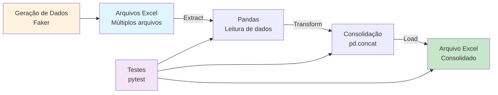

# Data Project Foundations

## 📋 Sobre

Este projeto demonstra como estruturar um projeto de dados profissional do zero, seguindo boas práticas de desenvolvimento. O projeto implementa uma pipeline ETL completa que consolida múltiplos arquivos Excel em um único arquivo, utilizando uma arquitetura modular e testável.

**Objetivo Educacional**: Aprender a estruturar projetos de dados profissionais com organização de código, testes automatizados, documentação e ferramentas de desenvolvimento modernas.

## 📊 Fluxo do Projeto



## 🎯 Objetivos de Aprendizado

- **Estruturação de projetos**: Organização de diretórios, separação de responsabilidades, modularização
- **ETL Pipeline**: Implementação de pipeline Extract-Transform-Load com separação clara de responsabilidades
- **Testes automatizados**: Criação de testes unitários com pytest
- **Gerenciamento de dependências**: Uso do Poetry para gerenciar dependências e ambientes virtuais
- **Documentação**: Criação de documentação automatizada com MkDocs
- **Versionamento**: Uso de Git e GitHub para controle de versão
- **Automação**: Configuração de tarefas com taskipy para facilitar execução de comandos comuns


## 📁 Estrutura do Projeto

```
01-data-project-foundations/
├── app/
│   ├── ETL/
│   │   ├── extract.py      # Extração de dados de arquivos Excel
│   │   ├── transform.py    # Transformação e consolidação de dados
│   │   ├── load.py         # Carga dos dados consolidados
│   │   └── pipeline.py     # Orquestração da pipeline ETL
│   ├── utils/
│   │   └── absenteeism_generator.py  # Geração de dados sintéticos para testes
│   └── main.py             # Ponto de entrada da aplicação
├── data/
│   ├── input/              # Arquivos Excel de entrada (gerados automaticamente)
│   └── output/             # Arquivo Excel consolidado (resultado da ETL)
├── tests/                  # Testes automatizados
├── docs/                   # Documentação do projeto
├── pyproject.toml          # Configuração do Poetry e dependências
├── mkdocs.yml             # Configuração do MkDocs
└── README.md              # Este arquivo
```

## 🛠️ Tecnologias e Ferramentas

- **Python 3.11.3**: Linguagem de programação
- **Pandas**: Manipulação e análise de dados
- **Poetry**: Gerenciamento de dependências e ambientes virtuais
- **pytest**: Framework de testes
- **MkDocs**: Geração de documentação
- **taskipy**: Automação de tarefas comuns
- **Faker**: Geração de dados sintéticos para testes
- **openpyxl**: Leitura e escrita de arquivos Excel

## 📦 Pré-requisitos

- Python 3.11.3 (gerenciado via pyenv)
- Poetry instalado
- Git configurado
- Editor de código (recomendado: VSCode)

**Links úteis para instalação:**
- [Instalar VSCode](https://code.visualstudio.com/download)
- [Instalar Git](https://git-scm.com/book/pt-br/v2)
- [Instalar Pyenv](https://github.com/pyenv/pyenv#installation)
- [Instalar Poetry](https://python-poetry.org/docs/#installation)

## 🚀 Como Usar

### Instalação

1. **Clone o repositório**:
   ```bash
   git clone https://github.com/lvgalvao/data-engineering-roadmap.git
   cd data-engineering-roadmap/01-projetos/01-data-project-foundations
   ```

2. **Configure a versão do Python**:
   ```bash
   pyenv install 3.11.3
   pyenv local 3.11.3
   ```

3. **Instale as dependências**:
   ```bash
   poetry install
   ```

4. **Ative o ambiente virtual**:
   ```bash
   poetry shell
   ```

### Execução

1. **Execute a pipeline ETL**:
   ```bash
   task run
   ```
   Este comando:
   - Gera 50 arquivos Excel com dados sintéticos de absenteísmo em `data/input/`
   - Consolida todos os arquivos em um único arquivo em `data/output/consolidated_absenteeism_data.xlsx`

2. **Execute os testes**:
   ```bash
   task test
   ```

3. **Visualize a documentação**:
   ```bash
   task doc
   ```
   A documentação será servida em `http://127.0.0.1:8000`

4. **Formate o código**:
   ```bash
   task format
   ```

## 📚 Conteúdo Real

### Pipeline ETL

O projeto implementa uma pipeline ETL completa:

1. **Extract (`app/ETL/extract.py`)**: 
   - Lê todos os arquivos `.xlsx` de um diretório
   - Retorna uma lista de DataFrames

2. **Transform (`app/ETL/transform.py`)**:
   - Consolida múltiplos DataFrames em um único DataFrame
   - Usa `pd.concat()` para combinar os dados

3. **Load (`app/ETL/load.py`)**:
   - Salva o DataFrame consolidado em um arquivo Excel
   - Cria o diretório de saída se não existir

4. **Pipeline (`app/ETL/pipeline.py`)**:
   - Orquestra as três etapas da ETL
   - Função principal: `pipeline_completa()`

### Geração de Dados Sintéticos

O módulo `app/utils/absenteeism_generator.py` gera dados sintéticos de absenteísmo usando a biblioteca Faker, incluindo:
- ID e nome do colaborador
- Departamento
- Motivo da ausência
- Horas de ausência
- Data da ausência
- Salário

### Testes

O projeto inclui testes automatizados na pasta `tests/` que validam o funcionamento da pipeline ETL.

## 🔗 Conexões com a Formação

- **Pré-requisitos**: Conhecimento básico de Python e Git
- **Próximos passos**: 
  - Projeto 02 (Python Big Data Processing) para processar volumes maiores de dados
  - Projeto 03 (CRUD API) para aprender sobre APIs e bancos de dados
  - Módulo de Airflow para orquestração de pipelines mais complexas

## 📖 Recursos Adicionais

- [Documentação do Poetry](https://python-poetry.org/docs/)
- [Documentação do pytest](https://docs.pytest.org/)
- [Documentação do MkDocs](https://www.mkdocs.org/)
- [Ebook: Testes em Python](https://www.linkedin.com/feed/update/urn:li:activity:7099722252144848896/)
- [Ebook: GitHub Actions](https://www.linkedin.com/feed/update/urn:li:activity:7098264928553201665/)

## 👤 Autor

**Luciano Filho** - [lvgalvaofilho@gmail.com](mailto:lvgalvaofilho@gmail.com)

---

**Parte da Formação Profissional em Engenharia de Dados - [Jornada de Dados](https://suajornadadedados.com.br/)**
