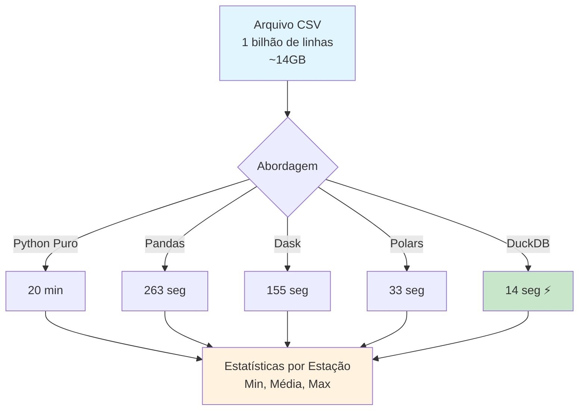

<div align="center">
  

# **Projeto: Python Big Data Processing**

### [Jornada de Dados](https://suajornadadedados.com.br/)

**Projeto prático sobre processamento eficiente de 1 bilhão de linhas comparando Python, Pandas, Dask, Polars e DuckDB**

[](https://suajornadadedados.com.br/)
[](https://python.org)
[](https://pandas.pydata.org/)
[](https://dask.org/)
[](https://pola-rs.github.io/polars/)
[](https://duckdb.org/)

</div>

-----

## 📋 Sobre

Este projeto demonstra como processar eficientemente **1 bilhão de linhas de dados** (~14GB) usando diferentes abordagens em Python. O desafio é calcular estatísticas (mínimo, média e máximo) de temperaturas por estação meteorológica, comparando o desempenho de várias bibliotecas e técnicas.

**Objetivo Educacional**: Entender as diferenças de performance entre diferentes abordagens de processamento de dados em Python e aprender a escolher a ferramenta certa para cada cenário de Big Data.

## 📊 Fluxo do Projeto



## 🎯 Objetivos de Aprendizado

- **Processamento de Big Data**: Aprender técnicas para processar grandes volumes de dados eficientemente
- **Comparação de bibliotecas**: Entender quando usar Python puro, Pandas, Dask, Polars ou DuckDB
- **Otimização de performance**: Identificar gargalos e otimizar código para grandes volumes
- **Streaming de dados**: Processar dados em lotes sem carregar tudo na memória
- **Benchmarking**: Comparar performance de diferentes implementações

## 📁 Estrutura do Projeto

```
02-python-big-data-processing/
├── src/
│   ├── create_measurements.py    # Gera arquivo de teste com 1 bilhão de linhas
│   ├── using_python.py            # Implementação em Python puro
│   ├── using_pandas.py           # Implementação com Pandas
│   ├── using_dask.py             # Implementação com Dask
│   ├── using_polars.py           # Implementação com Polars
│   ├── using_duckdb.py           # Implementação com DuckDB
│   └── using_bash_and_awk.sh      # Implementação em Bash + awk
├── data/
│   ├── measurements.txt          # Arquivo gerado com dados de teste
│   └── weather_stations.csv      # Lista de estações meteorológicas
├── pyproject.toml                # Dependências do projeto
└── README.md                     # Este arquivo
```

## 🛠️ Tecnologias e Ferramentas

- **Python 3.12.1**: Linguagem de programação
- **Pandas**: Biblioteca tradicional para análise de dados
- **Dask**: Processamento paralelo e distribuído
- **Polars**: Biblioteca moderna e rápida para DataFrames
- **DuckDB**: Banco de dados analítico em memória
- **Bash + awk**: Processamento via linha de comando

## 📦 Pré-requisitos

- Python 3.12.1 (gerenciado via pyenv)
- Poetry instalado
- Espaço em disco suficiente (~14GB para o arquivo de dados)
- Memória RAM adequada (8GB+ recomendado)

## 🚀 Como Usar

### Instalação

1. **Clone o repositório**:
   ```bash
   git clone https://github.com/lvgalvao/data-engineering-roadmap.git
   cd data-engineering-roadmap/01-projetos/02-python-big-data-processing
   ```

2. **Configure a versão do Python**:
   ```bash
   pyenv install 3.12.1
   pyenv local 3.12.1
   ```

3. **Instale as dependências**:
   ```bash
   poetry env use 3.12.1
   poetry install --no-root
   poetry lock --no-update
   ```

### Execução

1. **Gere o arquivo de teste** (isso pode levar ~10 minutos):
   ```bash
   python src/create_measurements.py
   ```
   Este comando gera o arquivo `data/measurements.txt` com 1 milhão de linhas por padrão. Para gerar 1 bilhão, modifique o código.

2. **Execute as diferentes implementações**:
   ```bash
   # Python puro
   python src/using_python.py
   
   # Pandas
   python src/using_pandas.py
   
   # Dask
   python src/using_dask.py
   
   # Polars
   python src/using_polars.py
   
   # DuckDB (mais rápido)
   python src/using_duckdb.py
   
   # Bash + awk
   chmod +x src/using_bash_and_awk.sh
   ./src/using_bash_and_awk.sh 1000000
   ```

## 📚 Conteúdo Real

### Formato dos Dados

O arquivo `measurements.txt` contém dados no formato:
```
Hamburg;12.0
Bulawayo;8.9
Palembang;38.8
...
```

Cada linha representa uma medição de temperatura de uma estação meteorológica.

### Implementações Disponíveis

1. **`using_python.py`**: 
   - Processamento linha por linha usando dicionários Python
   - Sem dependências externas além da biblioteca padrão
   - Tempo estimado: ~20 minutos para 1 bilhão de linhas

2. **`using_pandas.py`**:
   - Carrega dados em chunks usando `pd.read_csv()` com `chunksize`
   - Processa em lotes para economizar memória
   - Tempo estimado: ~263 segundos para 1 bilhão de linhas

3. **`using_dask.py`**:
   - Usa Dask para processamento paralelo
   - Processa dados em partições distribuídas
   - Tempo estimado: ~155 segundos para 1 bilhão de linhas

4. **`using_polars.py`**:
   - Usa Polars, biblioteca moderna escrita em Rust
   - Processamento otimizado e rápido
   - Tempo estimado: ~33 segundos para 1 bilhão de linhas

5. **`using_duckdb.py`**:
   - Usa DuckDB para processamento SQL direto em arquivos CSV
   - Mais rápido de todas as implementações
   - Tempo estimado: ~14 segundos para 1 bilhão de linhas

6. **`using_bash_and_awk.sh`**:
   - Processamento via linha de comando Unix
   - Usa `awk` para processamento e `sort` para ordenação
   - Tempo estimado: ~25 minutos para 1 bilhão de linhas

### Resultados Esperados

Cada implementação produz uma tabela ordenada por nome da estação com:
- `station`: Nome da estação meteorológica
- `min_temperature`: Temperatura mínima registrada
- `mean_temperature`: Temperatura média (arredondada para 1 casa decimal)
- `max_temperature`: Temperatura máxima registrada

### Benchmark de Performance

Resultados obtidos em um laptop M1 com 8GB de RAM processando 1 bilhão de linhas:

| Implementação | Tempo de Execução |
|---------------|-------------------|
| Bash + awk    | 25 minutos        |
| Python puro   | 20 minutos        |
| Pandas        | 263 segundos      |
| Dask          | 155.62 segundos   |
| Polars        | 33.86 segundos    |
| **DuckDB**    | **14.98 segundos** |

## 🔗 Conexões com a Formação

- **Pré-requisitos**: 
  - Projeto 01 (Data Project Foundations) para entender estruturação de projetos
  - Conhecimento básico de Python
- **Próximos passos**: 
  - Projeto 04 (Data Quality Engineering) para aplicar processamento em pipelines de qualidade
  - Projeto 08 (Databricks Data Modeling) para processamento distribuído em cloud

## 📖 Recursos Adicionais

- [The One Billion Row Challenge (original em Java)](https://github.com/gunnarmorling/1brc)
- [Documentação do DuckDB](https://duckdb.org/docs/)
- [Documentação do Polars](https://pola-rs.github.io/polars/)
- [Documentação do Dask](https://docs.dask.org/)

## 👤 Autor

**Luciano Filho** - [lvgalvaofilho@gmail.com](mailto:lvgalvaofilho@gmail.com)

**Contribuidores**: 
- [Koen Vossen](https://github.com/koenvo) - Implementação em Polars
- [Arthur Julião](https://github.com/ArthurJ) - Implementação em Python e Bash

---

**Parte da Formação Profissional em Engenharia de Dados - [Jornada de Dados](https://suajornadadedados.com.br/)**
