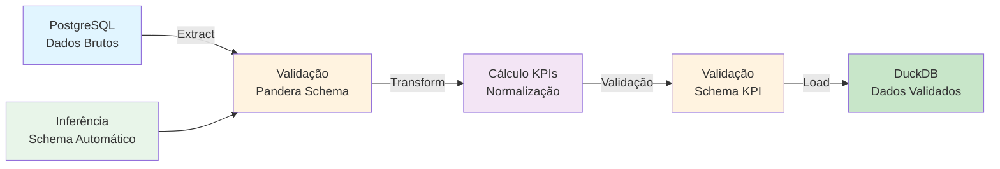

<div align="center">
  

# **Projeto: Data Quality Engineering**

### [Jornada de Dados](https://suajornadadedados.com.br/)

**Projeto prático sobre pipelines de qualidade de dados com validação de schemas e contratos de dados**

[](https://suajornadadedados.com.br/)
[](https://python.org)
[](https://pandera.readthedocs.io/)
[](https://duckdb.org/)
[](https://www.postgresql.org/)

</div>

-----

## 📋 Sobre

Este projeto demonstra como implementar **pipelines de qualidade de dados** utilizando validação de schemas, contratos de dados e tratamento de erros. O projeto implementa uma pipeline ETL que extrai dados de PostgreSQL, valida e transforma usando Pandera, e carrega em DuckDB para análise.

**Objetivo Educacional**: Aprender a garantir qualidade de dados em pipelines ETL através de validação de schemas, contratos de dados e tratamento de erros robusto.

## 📊 Fluxo do Projeto



## 🎯 Objetivos de Aprendizado

- **Validação de Schemas**: Usar Pandera para validar estruturas e tipos de dados
- **Contratos de Dados**: Definir contratos que garantem qualidade dos dados
- **Data Profiling**: Inferir schemas automaticamente a partir de dados existentes
- **ETL com Qualidade**: Integrar validação em cada etapa da pipeline ETL
- **DuckDB**: Usar DuckDB como banco de dados analítico para armazenar dados validados
- **Tratamento de Erros**: Implementar tratamento robusto de erros de validação

## 📁 Estrutura do Projeto

```
04-data-quality-engineering/
├── app/
│   ├── etl.py                    # Pipeline ETL principal com validação
│   ├── etl_infer_schema.py      # Inferência automática de schemas
│   ├── schema.py                 # Definição de schemas com Pandera
│   ├── schema_email.py           # Validação específica de emails
│   └── ler_duckdb.py             # Leitura de dados do DuckDB
├── sql/                          # Scripts SQL para criação de tabelas
├── tests/                        # Testes automatizados
├── docs/                         # Documentação adicional
├── inferred_schema.json          # Schema inferido automaticamente
├── my_duckdb.db                  # Banco DuckDB (gerado após execução)
├── schema_crm.py                 # Schema do CRM
└── README.md                      # Este arquivo
```

## 🛠️ Tecnologias e Ferramentas

- **Python 3.x**: Linguagem de programação
- **Pandera**: Validação de schemas e contratos de dados
- **Pandas**: Manipulação e transformação de dados
- **DuckDB**: Banco de dados analítico em memória
- **PostgreSQL**: Banco de dados fonte (opcional, pode usar dados locais)
- **SQLAlchemy**: Conexão com bancos de dados SQL
- **python-dotenv**: Gerenciamento de variáveis de ambiente

## 📦 Pré-requisitos

- Python 3.11+ instalado
- Poetry instalado (ou pip)
- PostgreSQL instalado e configurado (opcional)
- Conhecimento básico de Python e SQL

## 🚀 Como Usar

### Instalação

1. **Clone o repositório**:
   ```bash
   git clone https://github.com/lvgalvao/data-engineering-roadmap.git
   cd data-engineering-roadmap/01-projetos/04-data-quality-engineering
   ```

2. **Instale as dependências**:
   ```bash
   poetry install
   # ou
   pip install -r requirements.txt
   ```

3. **Configure variáveis de ambiente** (se usar PostgreSQL):
   Crie um arquivo `.env` com:
   ```env
   POSTGRES_HOST=localhost
   POSTGRES_USER=user
   POSTGRES_PASSWORD=password
   POSTGRES_DB=database
   POSTGRES_PORT=5432
   ```

### Execução

1. **Execute a pipeline ETL com validação**:
   ```bash
   python app/etl.py
   ```

2. **Inferir schema automaticamente**:
   ```bash
   python app/etl_infer_schema.py
   ```

3. **Ler dados do DuckDB**:
   ```bash
   python app/ler_duckdb.py
   ```

## 📚 Conteúdo Real

### Pipeline ETL com Validação

O projeto implementa uma pipeline ETL completa com validação em cada etapa:

1. **Extract (`extrair_do_sql`)**:
   - Extrai dados de PostgreSQL usando SQLAlchemy
   - Valida dados de saída usando `@pa.check_output(ProdutoSchema)`
   - Retorna DataFrame validado

2. **Transform (`transformar`)**:
   - Valida dados de entrada usando `@pa.check_input(ProdutoSchema)`
   - Calcula KPIs: `valor_total_estoque = quantidade * preco`
   - Normaliza categorias para minúsculas
   - Determina disponibilidade baseado em quantidade
   - Valida dados de saída usando `@pa.check_output(ProductSchemaKPI)`

3. **Load (`load_to_duckdb`)**:
   - Valida dados de entrada usando `@pa.check_input(ProductSchemaKPI)`
   - Carrega dados validados no DuckDB
   - Cria ou substitui tabela no DuckDB

### Schemas e Validação

O projeto define schemas usando Pandera:

- **`ProdutoSchema`**: Schema para dados brutos extraídos do PostgreSQL
  - Valida tipos, valores obrigatórios, formatos
  - Inclui validação de emails usando regex

- **`ProductSchemaKPI`**: Schema para dados transformados
  - Valida campos calculados
  - Garante consistência dos KPIs

### Inferência de Schema

O módulo `etl_infer_schema.py` demonstra como:
- Inferir schema automaticamente a partir de dados existentes
- Gerar arquivo JSON com schema inferido
- Usar schema inferido para validação

### Validação de Emails

O módulo `schema_email.py` implementa validação específica de emails usando:
- Expressões regulares (regex)
- Validação de formato
- Tratamento de casos especiais

## 🔗 Conexões com a Formação

- **Pré-requisitos**: 
  - Projeto 01 (Data Project Foundations) para entender estruturação de projetos
  - Projeto 02 (Python Big Data Processing) para entender DuckDB
  - Conhecimento básico de Python e SQL
- **Próximos passos**: 
  - Projeto 08 (Databricks Data Modeling) para aplicar qualidade em ambientes cloud
  - Módulo de dbt em `04-sql-analytics-dbt-core/` para validação com dbt

## 📖 Recursos Adicionais

- [Documentação do Pandera](https://pandera.readthedocs.io/)
- [Documentação do DuckDB](https://duckdb.org/docs/)
- [Best Practices de Data Quality](https://www.getdbt.com/blog/data-quality)

## 👤 Autor

**Luciano Filho** - [lvgalvaofilho@gmail.com](mailto:lvgalvaofilho@gmail.com)

---

**Parte da Formação Profissional em Engenharia de Dados - [Jornada de Dados](https://suajornadadedados.com.br/)**
