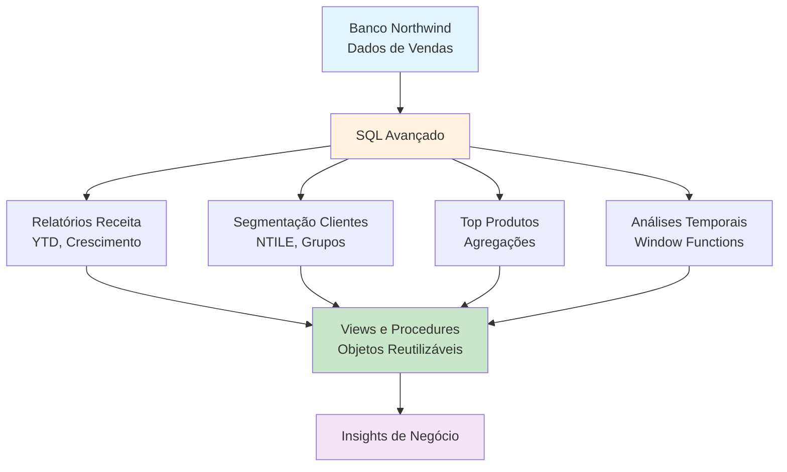

# SQL Advanced Analytics

## 📋 Sobre

Este projeto demonstra como realizar **análises avançadas de dados usando SQL** com o banco de dados Northwind, um ERP completo com dados de vendas, clientes, produtos e pedidos. O projeto inclui relatórios complexos usando Window Functions, CTEs, Views e Stored Procedures.

**Objetivo Educacional**: Dominar SQL avançado para análise de dados, incluindo funções de janela, agregações complexas, segmentação de clientes e análises temporais.

## 📊 Fluxo do Projeto



## 🎯 Objetivos de Aprendizado

- **SQL Avançado**: Usar Window Functions, CTEs e subqueries complexas
- **Análise de Receitas**: Calcular receitas totais, mensais, YTD e crescimento
- **Segmentação de Clientes**: Agrupar clientes por valor usando NTILE
- **Análises Temporais**: Trabalhar com dados temporais e períodos
- **Views e Stored Procedures**: Criar objetos reutilizáveis no banco de dados
- **Análise de Produtos**: Identificar produtos mais vendidos e KPIs

## Relatórios que vamos criar

1. **Relatórios de Receita**
    
    * Qual foi o total de receitas no ano de 1997?

    ```sql
    CREATE VIEW total_revenues_1997_view AS
    SELECT SUM((order_details.unit_price) * order_details.quantity * (1.0 - order_details.discount)) AS total_revenues_1997
    FROM order_details
    INNER JOIN (
        SELECT order_id 
        FROM orders 
        WHERE EXTRACT(YEAR FROM order_date) = '1997'
    ) AS ord 
    ON ord.order_id = order_details.order_id;
    ```

    * Faça uma análise de crescimento mensal e o cálculo de YTD

    ```sql
    CREATE VIEW view_receitas_acumuladas AS
    WITH ReceitasMensais AS (
        SELECT
            EXTRACT(YEAR FROM orders.order_date) AS Ano,
            EXTRACT(MONTH FROM orders.order_date) AS Mes,
            SUM(order_details.unit_price * order_details.quantity * (1.0 - order_details.discount)) AS Receita_Mensal
        FROM
            orders
        INNER JOIN
            order_details ON orders.order_id = order_details.order_id
        GROUP BY
            EXTRACT(YEAR FROM orders.order_date),
            EXTRACT(MONTH FROM orders.order_date)
    ),
    ReceitasAcumuladas AS (
        SELECT
            Ano,
            Mes,
            Receita_Mensal,
            SUM(Receita_Mensal) OVER (PARTITION BY Ano ORDER BY Mes) AS Receita_YTD
        FROM
            ReceitasMensais
    )
    SELECT
        Ano,
        Mes,
        Receita_Mensal,
        Receita_Mensal - LAG(Receita_Mensal) OVER (PARTITION BY Ano ORDER BY Mes) AS Diferenca_Mensal,
        Receita_YTD,
        (Receita_Mensal - LAG(Receita_Mensal) OVER (PARTITION BY Ano ORDER BY Mes)) / LAG(Receita_Mensal) OVER (PARTITION BY Ano ORDER BY Mes) * 100 AS Percentual_Mudanca_Mensal
    FROM
        ReceitasAcumuladas
    ORDER BY
        Ano, Mes;
    ```

2. **Segmentação de clientes**
    
    * Qual é o valor total que cada cliente já pagou até agora?

    ```sql
    CREATE VIEW view_total_revenues_per_customer AS
    SELECT 
        customers.company_name, 
        SUM(order_details.unit_price * order_details.quantity * (1.0 - order_details.discount)) AS total
    FROM 
        customers
    INNER JOIN 
        orders ON customers.customer_id = orders.customer_id
    INNER JOIN 
        order_details ON order_details.order_id = orders.order_id
    GROUP BY 
        customers.company_name
    ORDER BY 
        total DESC;
    ```

    * Separe os clientes em 5 grupos de acordo com o valor pago por cliente

    ```sql
    CREATE VIEW view_total_revenues_per_customer_group AS
    SELECT 
    customers.company_name, 
    SUM(order_details.unit_price * order_details.quantity * (1.0 - order_details.discount)) AS total,
    NTILE(5) OVER (ORDER BY SUM(order_details.unit_price * order_details.quantity * (1.0 - order_details.discount)) DESC) AS group_number
    FROM 
        customers
    INNER JOIN 
        orders ON customers.customer_id = orders.customer_id
    INNER JOIN 
        order_details ON order_details.order_id = orders.order_id
    GROUP BY 
        customers.company_name
    ORDER BY 
        total DESC;
    ```


    * Agora somente os clientes que estão nos grupos 3, 4 e 5 para que seja feita uma análise de Marketing especial com eles

    ```sql
    CREATE VIEW clients_to_marketing AS
    WITH clientes_para_marketing AS (
        SELECT 
        customers.company_name, 
        SUM(order_details.unit_price * order_details.quantity * (1.0 - order_details.discount)) AS total,
        NTILE(5) OVER (ORDER BY SUM(order_details.unit_price * order_details.quantity * (1.0 - order_details.discount)) DESC) AS group_number
    FROM 
        customers
    INNER JOIN 
        orders ON customers.customer_id = orders.customer_id
    INNER JOIN 
        order_details ON order_details.order_id = orders.order_id
    GROUP BY 
        customers.company_name
    ORDER BY 
        total DESC
    )

    SELECT *
    FROM clientes_para_marketing
    WHERE group_number >= 3;
    ```

3. **Top 10 Produtos Mais Vendidos**
    
    * Identificar os 10 produtos mais vendidos.

    ```sql
    CREATE VIEW top_10_products AS
    SELECT products.product_name, SUM(order_details.unit_price * order_details.quantity * (1.0 - order_details.discount)) AS sales
    FROM products
    INNER JOIN order_details ON order_details.product_id = products.product_id
    GROUP BY products.product_name
    ORDER BY sales DESC;
    ```

4. **Clientes do Reino Unido que Pagaram Mais de 1000 Dólares**
    
    * Quais clientes do Reino Unido pagaram mais de 1000 dólares?

    ```sql
    CREATE VIEW uk_clients_who_pay_more_then_1000 AS
    SELECT customers.contact_name, SUM(order_details.unit_price * order_details.quantity * (1.0 - order_details.discount) * 100) / 100 AS payments
    FROM customers
    INNER JOIN orders ON orders.customer_id = customers.customer_id
    INNER JOIN order_details ON order_details.order_id = orders.order_id
    WHERE LOWER(customers.country) = 'uk'
    GROUP BY customers.contact_name
    HAVING SUM(order_details.unit_price * order_details.quantity * (1.0 - order_details.discount)) > 1000;
    ```

## 📁 Estrutura do Projeto

```
05-sql-advanced-analytics/
├── relatorios/
│   ├── [arquivos SQL com diferentes análises]
├── northwind.sql            # Script SQL para criar o banco de dados
├── docker-compose.yml        # Configuração Docker com PostgreSQL e PgAdmin
├── pics/                     # Diagramas e imagens
└── README.md                 # Este arquivo
```

## 🛠️ Tecnologias e Ferramentas

- **PostgreSQL**: Banco de dados relacional
- **SQL**: Linguagem de consulta estruturada
- **Docker**: Containerização do ambiente
- **PgAdmin**: Interface gráfica para gerenciamento do banco

## 📦 Pré-requisitos

- Docker e Docker Compose instalados
- Conhecimento básico de SQL
- Editor de código ou cliente SQL (recomendado: DBeaver, pgAdmin)

## 🚀 Como Usar

### Instalação com Docker

1. **Clone o repositório**:
   ```bash
   git clone https://github.com/lvgalvao/data-engineering-roadmap.git
   cd data-engineering-roadmap/01-projetos/05-sql-advanced-analytics
   ```

2. **Inicie os serviços**:
   ```bash
   docker-compose up -d
   ```

3. **Acesse o PgAdmin**:
   - URL: http://localhost:5050
   - Senha: `postgres`

4. **Configure conexão no PgAdmin**:
   - Host: `db`
   - Usuário: `postgres`
   - Senha: `postgres`
   - Banco: `northwind`

5. **Execute o script SQL**:
   - Abra o arquivo `northwind.sql` no PgAdmin
   - Execute para criar o banco de dados e popular com dados

## 📚 Conteúdo Real

### Contexto do Banco de Dados

O banco de dados `Northwind` contém dados de vendas de uma empresa chamada `Northwind Traders`, que importa e exporta alimentos especiais. O banco inclui 14 tabelas com dados de:

- **Fornecedores**: Fornecedores e vendedores
- **Clientes**: Clientes que compram produtos
- **Funcionários**: Detalhes dos funcionários
- **Produtos**: Informações dos produtos
- **Transportadoras**: Detalhes dos transportadores
- **Pedidos e Detalhes**: Transações de vendas


### Relatórios Disponíveis

O projeto inclui os seguintes relatórios SQL avançados: 

### Conceitos SQL Demonstrados

- **Window Functions**: `ROW_NUMBER()`, `LAG()`, `SUM() OVER()`
- **CTEs (Common Table Expressions)**: Organização de queries complexas
- **Agregações**: `SUM()`, `AVG()`, `COUNT()`, `GROUP BY`
- **Joins**: `INNER JOIN`, múltiplos joins
- **Funções de Data**: `EXTRACT()`, `DATE_PART()`
- **NTILE**: Segmentação em grupos
- **HAVING**: Filtragem de grupos agregados

## 🔗 Conexões com a Formação

- **Pré-requisitos**: 
  - Conhecimento básico de SQL
  - Projeto 03 (CRUD API) para entender bancos de dados relacionais
- **Próximos passos**: 
  - Módulo completo de SQL em `04-sql-analytics-dbt-core/`
  - Projeto 08 (Databricks Data Modeling) para aplicar SQL em ambientes cloud

## 📖 Recursos Adicionais

- [Documentação do PostgreSQL](https://www.postgresql.org/docs/)
- [SQL Window Functions](https://www.postgresql.org/docs/current/tutorial-window.html)
- [Northwind Database](https://github.com/microsoft/sql-server-samples/tree/master/samples/databases/northwind-pubs)

## 👤 Autor

**Luciano Filho** - [lvgalvaofilho@gmail.com](mailto:lvgalvaofilho@gmail.com)

---

**Parte da Formação Profissional em Engenharia de Dados - [Jornada de Dados](https://suajornadadedados.com.br/)**
