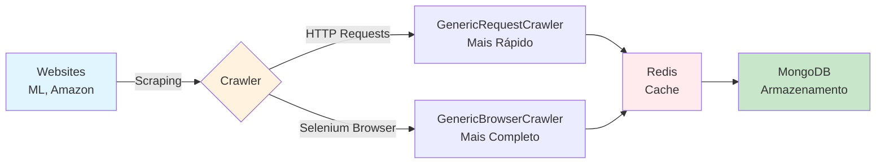

# Web Scraping NoSQL Pipelines

## 📋 Sobre

Este projeto demonstra como construir **pipelines de web scraping** utilizando Python com armazenamento em bancos de dados NoSQL (Redis e MongoDB). O projeto implementa crawlers genéricos que podem ser adaptados para diferentes sites, utilizando tanto requisições HTTP simples quanto navegadores automatizados (Selenium).

**Objetivo Educacional**: Aprender técnicas de web scraping, trabalhar com bancos NoSQL, implementar crawlers reutilizáveis e gerenciar cache com Redis.

## 📊 Fluxo do Projeto



## 🎯 Objetivos de Aprendizado

- **Web Scraping**: Extrair dados de websites usando Requests e Selenium
- **Crawlers Genéricos**: Criar crawlers reutilizáveis para múltiplos sites
- **Redis**: Usar Redis como cache e message broker
- **MongoDB**: Armazenar dados não-estruturados em banco NoSQL
- **Arquitetura Modular**: Organizar código em módulos reutilizáveis
- **Automação de Navegadores**: Controlar navegadores com Selenium

## 📁 Estrutura do Projeto

```
06-web-scraping-nosql-pipelines/
├── src/
│   ├── browser/              # Crawlers baseados em navegador (Selenium)
│   │   ├── generic_crawler.py
│   │   ├── b_ml_simple.py    # Exemplo: Mercado Livre
│   │   └── crawlers/         # Implementações específicas
│   ├── request/              # Crawlers baseados em requisições HTTP
│   │   ├── generic_crawler.py
│   │   ├── r_ml_simple.py    # Exemplo: Mercado Livre
│   │   └── crawlers/         # Implementações específicas
│   ├── mitm/                 # Proxy e interceptação de tráfego
│   ├── tools/
│   │   ├── mongodb.py        # Utilitários para MongoDB
│   │   └── redis.py          # Utilitários para Redis
│   └── start.py              # Ponto de entrada
├── docker/                   # Configurações Docker
├── pyproject.toml            # Dependências
└── README.md                 # Este arquivo
```

## 🛠️ Tecnologias e Ferramentas

- **Python 3.x**: Linguagem de programação
- **Requests**: Biblioteca para requisições HTTP
- **BeautifulSoup**: Parsing de HTML
- **Selenium**: Automação de navegadores
- **Scrapy**: Framework para web scraping (opcional)
- **Redis**: Cache e message broker em memória
- **MongoDB**: Banco de dados NoSQL orientado a documentos
- **Docker**: Containerização (opcional)

## 📦 Pré-requisitos

- Python 3.11+ instalado
- Poetry instalado (ou pip)
- Redis instalado e rodando (ou via Docker)
- MongoDB instalado e rodando (ou via Docker)
- Chrome/Chromium instalado (para crawlers com Selenium)
- Conhecimento básico de Python e HTML

## 🚀 Como Usar

### Instalação

1. **Clone o repositório**:
   ```bash
   git clone https://github.com/lvgalvao/data-engineering-roadmap.git
   cd data-engineering-roadmap/01-projetos/06-web-scraping-nosql-pipelines
   ```

2. **Instale as dependências**:
   ```bash
   poetry install
   # ou
   pip install -r requirements.txt
   ```

3. **Inicie Redis e MongoDB** (se usar Docker):
   ```bash
   docker-compose -f docker/docker-compose.yml up -d
   ```

### Execução

1. **Execute o crawler de exemplo**:
   ```bash
   python src/start.py
   ```

2. **Ou use os crawlers individuais**:
   ```bash
   # Crawler com navegador (Selenium)
   python src/browser/b_ml_simple.py
   
   # Crawler com requisições HTTP
   python src/request/r_ml_simple.py
   ```

## 📚 Conteúdo Real

### Crawlers Genéricos

O projeto implementa dois tipos de crawlers genéricos:

1. **`GenericBrowserCrawler`** (`src/browser/generic_crawler.py`):
   - Usa Selenium para controlar navegadores
   - Útil para sites com JavaScript pesado
   - Mais lento, mas mais completo

2. **`GenericRequestCrawler`** (`src/request/generic_crawler.py`):
   - Usa Requests para requisições HTTP diretas
   - Mais rápido e eficiente
   - Ideal para sites estáticos

### Exemplos Implementados

- **Mercado Livre**: Crawlers para buscar produtos no ML
- **Amazon**: Crawlers para buscar produtos na Amazon

### Integração com NoSQL

- **Redis** (`src/tools/redis.py`):
  - Cache de requisições
  - Fila de mensagens
  - Armazenamento temporário

- **MongoDB** (`src/tools/mongodb.py`):
  - Armazenamento persistente de dados extraídos
  - Estrutura flexível para dados não-estruturados

### Proxy e Interceptação

O módulo `mitm/` implementa:
- Proxy para interceptar requisições
- Controle de tráfego de rede
- Testes de conectividade

## 🔗 Conexões com a Formação

- **Pré-requisitos**: 
  - Projeto 01 (Data Project Foundations) para entender estruturação
  - Conhecimento básico de Python e HTML
- **Próximos passos**: 
  - Projeto 07 (PDF Data Extraction) para extração de dados não-estruturados
  - Módulo de APIs em `05-engenharia-de-dados-e-ia/06-restAPI-fastAPI-deploy/`

## 📖 Recursos Adicionais

- [Documentação do Requests](https://requests.readthedocs.io/)
- [Documentação do Selenium](https://www.selenium.dev/documentation/)
- [Documentação do BeautifulSoup](https://www.crummy.com/software/BeautifulSoup/bs4/doc/)
- [Documentação do Redis](https://redis.io/docs/)
- [Documentação do MongoDB](https://www.mongodb.com/docs/)

## 👤 Autor

**Luciano Filho** - [lvgalvaofilho@gmail.com](mailto:lvgalvaofilho@gmail.com)

---

**Parte da Formação Profissional em Engenharia de Dados - [Jornada de Dados](https://suajornadadedados.com.br/)**
