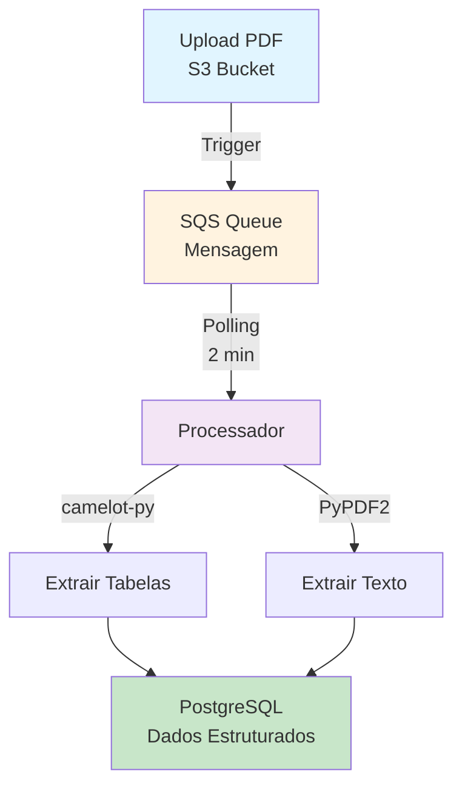

# PDF Data Extraction

## 📋 Sobre

Este projeto demonstra como **extrair dados de arquivos PDF** armazenados no Amazon S3, utilizando triggers do Amazon SQS para processamento automatizado. A solução extrai tanto tabelas quanto texto de PDFs e armazena os dados em PostgreSQL.

**Objetivo Educacional**: Aprender a processar dados não-estruturados (PDFs), integrar com serviços AWS (S3, SQS), e implementar pipelines event-driven.

## 📊 Fluxo do Projeto



## 🎯 Objetivos de Aprendizado

- **Extração de PDFs**: Extrair tabelas e texto de arquivos PDF
- **AWS S3**: Armazenar e gerenciar arquivos na nuvem
- **AWS SQS**: Implementar processamento baseado em eventos
- **PostgreSQL**: Armazenar dados extraídos de forma estruturada
- **Event-Driven Architecture**: Processar arquivos automaticamente quando são enviados
- **Expressões Regulares**: Processar textos semi-estruturados extraídos de PDFs

## 📁 Estrutura do Projeto

```
07-pdf-data-extraction/
├── src/
│   ├── __init__.py              # Scheduler principal (executa a cada 2 minutos)
│   ├── table_pdf_extractor.py   # Extração de tabelas com camelot-py
│   ├── text_pdf_extractor.py    # Extração de texto com PyPDF2
│   ├── pdf_viz.py               # Visualização de PDFs
│   ├── configs/
│   │   ├── tools/
│   │   │   ├── aws/
│   │   │   │   ├── s3.py        # Utilitários S3
│   │   │   │   └── sqs.py        # Utilitários SQS
│   │   │   ├── postgre.py       # Conexão PostgreSQL
│   │   │   └── queue.py         # Listener SQS
│   │   └── rules/
│   │       └── notas.py          # Regras de processamento
│   └── files/
│       ├── pdf/                  # PDFs de exemplo
│       ├── csv/                  # CSVs extraídos
│       └── img/                   # Imagens
├── docker/                       # Configurações Docker
├── regex_basic.md                # Guia de expressões regulares
├── pyproject.toml                # Dependências
└── README.md                     # Este arquivo
```

## 🛠️ Tecnologias e Ferramentas

- **Python 3.x**: Linguagem de programação
- **camelot-py**: Extração de tabelas de PDFs
- **PyPDF2**: Extração de texto de PDFs
- **boto3**: SDK da AWS para Python
- **psycopg2**: Driver PostgreSQL para Python
- **schedule**: Agendamento de tarefas
- **AWS S3**: Armazenamento de objetos
- **AWS SQS**: Fila de mensagens
- **PostgreSQL**: Banco de dados relacional

## 📦 Pré-requisitos

- Python 3.11+ instalado
- Poetry instalado (ou pip)
- Conta AWS configurada com acesso a S3 e SQS
- PostgreSQL instalado e configurado
- Credenciais AWS configuradas (AWS_ACCESS_KEY_ID, AWS_SECRET_ACCESS_KEY)

## 🚀 Como Usar

### Instalação

1. **Clone o repositório**:
   ```bash
   git clone https://github.com/lvgalvao/data-engineering-roadmap.git
   cd data-engineering-roadmap/01-projetos/07-pdf-data-extraction
   ```

2. **Instale as dependências**:
   ```bash
   poetry install
   # ou
   pip install -r requirements.txt
   ```

3. **Configure variáveis de ambiente**:
   ```bash
   export AWS_ACCESS_KEY_ID=your_access_key
   export AWS_SECRET_ACCESS_KEY=your_secret_key
   export AWS_REGION=us-east-1
   export QUEUE_NAME=pdf-processing-queue
   export DB_NAME=pdf_extraction
   export DB_USER=user
   export DB_PASSWORD=password
   export DB_HOST=localhost
   export DB_PORT=5432
   ```

### Execução

1. **Execute o scheduler** (verifica SQS a cada 2 minutos):
   ```bash
   python src/__init__.py
   ```

2. **Ou execute extrações individuais**:
   ```bash
   # Extrair tabelas de um PDF
   python src/table_pdf_extractor.py
   
   # Extrair texto de um PDF
   python src/text_pdf_extractor.py
   ```

## 📚 Conteúdo Real

### Fluxo da Aplicação

1. **Upload para S3**: Usuário faz upload de PDF para bucket S3
2. **Trigger SQS**: S3 envia mensagem para fila SQS
3. **Processamento**: Aplicação verifica SQS a cada 2 minutos
4. **Extração**: Quando encontra nova mensagem:
   - Extrai tabelas usando `camelot-py`
   - Extrai texto usando `PyPDF2`
5. **Armazenamento**: Dados extraídos são salvos no PostgreSQL

### Módulos Principais

1. **`table_pdf_extractor.py`**:
   - Usa `camelot-py` para detectar e extrair tabelas
   - Salva tabelas como CSV
   - Armazena metadados no PostgreSQL

2. **`text_pdf_extractor.py`**:
   - Usa `PyPDF2` para extrair texto completo
   - Processa texto com regex (ver `regex_basic.md`)
   - Armazena texto processado no PostgreSQL

3. **`configs/tools/queue.py`**:
   - Implementa `HTMLSQSListener` para monitorar SQS
   - Processa mensagens automaticamente
   - Gerencia ciclo de vida das mensagens

4. **`configs/tools/aws/s3.py`**:
   - Download de arquivos do S3
   - Upload de resultados processados
   - Gerenciamento de buckets

5. **`configs/tools/aws/sqs.py`**:
   - Envio e recebimento de mensagens
   - Gerenciamento de filas
   - Tratamento de erros

### Expressões Regulares

O arquivo `regex_basic.md` contém:
- Guia básico de regex
- Padrões comuns para processar textos de PDFs
- Exemplos práticos aplicados ao projeto

### Dados de Exemplo

O projeto inclui PDFs de exemplo em `src/files/pdf/`:
- Faturas de corretora
- Faturas Redrex
- Outros documentos estruturados

## 🔗 Conexões com a Formação

- **Pré-requisitos**: 
  - Projeto 06 (Web Scraping) para entender extração de dados
  - Conhecimento básico de AWS
  - Projeto 03 (CRUD API) para entender PostgreSQL
- **Próximos passos**: 
  - Módulo AWS completo em `06-cloud-aws-para-dados/`
  - Projeto 08 (Databricks) para processamento em cloud

## 📖 Recursos Adicionais

- [Documentação do camelot-py](https://camelot-py.readthedocs.io/)
- [Documentação do PyPDF2](https://pypdf2.readthedocs.io/)
- [Documentação do boto3](https://boto3.amazonaws.com/v1/documentation/api/latest/index.html)
- [Guia de Expressões Regulares](regex_basic.md)
- [AWS S3 Documentation](https://docs.aws.amazon.com/s3/)
- [AWS SQS Documentation](https://docs.aws.amazon.com/sqs/)

## 👤 Autor

**Luciano Filho** - [lvgalvaofilho@gmail.com](mailto:lvgalvaofilho@gmail.com)

---

**Parte da Formação Profissional em Engenharia de Dados - [Jornada de Dados](https://suajornadadedados.com.br/)**
