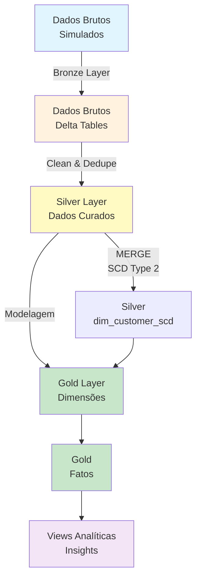

# Databricks Data Modeling

## 📋 Sobre

Este projeto demonstra, de ponta a ponta, a construção de um **Data Warehouse completo no Databricks** utilizando o padrão **Bronze → Silver → Gold** com Delta Lake. Inclui implementação de SCD Type 2 para clientes, deduplicação incremental, modelagem dimensional (fato/dimensão) e views analíticas.

**Objetivo Educacional**: Aprender modelagem de dados em ambientes cloud, padrão Lakehouse, processamento incremental e modelagem dimensional.

**Compatibilidade**: As instruções e notebooks foram pensadas para rodar no Databricks Free Edition (Community/Trial), com observações sobre ambientes com/sem Unity Catalog.

## 📊 Arquitetura do Projeto



## 🎯 Objetivos de Aprendizado

- **Padrão Bronze-Silver-Gold**: Implementar camadas de dados no Lakehouse
- **Delta Lake**: Trabalhar com tabelas Delta e time travel
- **SCD Type 2**: Implementar Slowly Changing Dimensions
- **Modelagem Dimensional**: Criar dimensões e fatos
- **Processamento Incremental**: Usar MERGE e watermarks
- **Unity Catalog**: Gerenciar catálogo de dados (opcional)
- **Databricks Jobs**: Orquestrar pipelines com Jobs

## 🛠️ Tecnologias e Ferramentas

- **Databricks**: Plataforma de analytics e data engineering
- **Delta Lake**: Storage layer com ACID transactions
- **Spark SQL**: Processamento distribuído de dados
- **Unity Catalog**: Governança de dados (opcional)
- **Python/SQL**: Linguagens de programação

**Repositórios originais:**
- Repositório oficial: [github.com/alanceloth/workshop_modelagem_dados_databricks_ao_vivo](https://github.com/alanceloth/workshop_modelagem_dados_databricks_ao_vivo)
- Repositório da aula ao vivo: [github.com/alanceloth/workshop_modelagem_dados_databricks](https://github.com/alanceloth/workshop_modelagem_dados_databricks)

## Arquitetura e Fluxo

- **Bronze**: geração/simulação de dados brutos heterogêneos (tipos como string, valores nulos e inconsistências) diretamente em tabelas Delta.
- **Silver**: curadoria incremental com `MERGE` e janelas de watermark. Padroniza tipos, normaliza status, deduplica registros e mantém SCD Type 2 para clientes.
- **Gold**: publicação do modelo dimensional (dimensões e fatos), com snapshot corrente de cliente e versão SCD completa, além de views de conveniência.

## Estrutura do repositório

- **notebooks/**
  - `bronze_layer.ipynb`: gera tabelas Bronze (`orders`, `order_items`, `customers`, `products`).
  - `silver_layer.ipynb`: cria/atualiza tabelas Silver (`orders_clean`, `order_items_clean`, `products_clean`, `dim_customer_scd`).
  - `gold_layer.ipynb`: cria/atualiza dimensões e fatos Gold (`dim_tempo`, `dim_produto`, `dim_cliente`, `dim_cliente_scd`, `fact_vendas`, `fact_vendas_current`) e views (`vw_vendas_diarias`, `vw_receita_por_estado`).

- **models/**
  - `silver/*.dbquery.ipynb` e `gold/*.dbquery.ipynb`: cadernos focados nas consultas SQL específicas das camadas Silver/Gold.

- **jobs/**
  - `data_warehouse_job.yaml`: definição de um Job (Databricks Asset Bundle) com dependências entre tarefas baseadas em consultas SQL.

## Objetos criados (tabelas e views)

- Bronze (schema: `bronze`)
  - `products`, `customers`, `orders`, `order_items`

- Silver (schema: `silver`)
  - `orders_clean` (dedupe + hash idempotente)
  - `order_items_clean` (dedupe por `order_id`,`product_id` + hash)
  - `products_clean` (tipos normalizados + hash)
  - `dim_customer_scd` (SCD Type 2: `effective_start`, `effective_end`, `is_current`)

- Gold (schema: `gold`)
  - `dim_tempo` (insert-only com `tempo_sk`)
  - `dim_produto` (NK=`product_id`, SK gerado)
  - `dim_cliente` (snapshot corrente da SCD da Silver, 1 linha por NK)
  - `dim_cliente_scd` (replica time-aware da SCD da Silver)
  - `fact_vendas` (grão: item do pedido, com FKs para tempo, produto e cliente SCD)
  - `fact_vendas_current` (snapshot baseado na `dim_cliente` corrente)
  - Views: `vw_vendas_diarias`, `vw_receita_por_estado`

## Como executar (Databricks)

1) **Importe os notebooks** para o seu workspace Databricks:
- Via Databricks Repos (git) ou upload manual de `notebooks/*.ipynb`.

2) **Crie e inicie um cluster** (ou use um existente) com suporte a Delta Lake.
- O notebook Bronze instala `Faker` via `%pip install Faker` na primeira célula se necessário.

3) **Defina o uso (com/sem Unity Catalog)**:
- Nos notebooks, o padrão usa o catálogo `workshop_modelagem` e schemas `bronze`, `silver`, `gold`.
- Se seu workspace NÃO tem Unity Catalog, ajuste:
  - No `bronze_layer.ipynb`, defina `CATALOG = None` (já há suporte no código) para criar apenas databases (sem catálogo).
  - Nos notebooks `silver_layer.ipynb` e `gold_layer.ipynb`, remova/ignore as linhas `USE CATALOG workshop_modelagem;` e garanta que os comandos apontem para os schemas simples (`bronze`, `silver`, `gold`).

4) **Ordem de execução recomendada**:
- `notebooks/bronze_layer.ipynb`
- `notebooks/silver_layer.ipynb`
- `notebooks/gold_layer.ipynb`

5) **Validações rápidas** (exemplos):
```sql
-- Receita líquida por dia
SELECT * FROM gold.vw_vendas_diarias ORDER BY data;

-- Receita líquida por dia e estado
SELECT * FROM gold.vw_receita_por_estado ORDER BY data, state;

-- Fato particionada por tempo
SELECT COUNT(*) FROM gold.fact_vendas;
```

## Incremental e Idempotência

- Silver usa `MERGE INTO` com hashes de linha para evitar updates sem mudanças reais.
- Deduplicações determinísticas por janela (`ROW_NUMBER()`) em `orders` e `order_items`.
- Watermarks (ex.: 60–90 dias) controlam janelas incrementais.
- Gold reusa hashes e chaves de negócio para `MERGE` idempotente.

## SCD Type 2 (Clientes)

- Implementado em `silver.dim_customer_scd` com colunas `effective_start`, `effective_end`, `is_current` e `row_hash`.
- Publicado em Gold como:
  - `gold.dim_cliente` (snapshot corrente; 1 linha por `nk_customer_id`).
  - `gold.dim_cliente_scd` (histórico completo para joins time-aware).

## Job (Databricks Asset Bundle)

- Arquivo: `jobs/data_warehouse_job.yaml`.
- Define o job "e-commerce data warehouse" com tarefas e dependências em SQL (Databricks SQL Warehouse requerido):
  - Silver: `orders_clean`, `order_items_clean`, `products_clean`, `dim_customer_scd`.
  - Gold: `dim_tempo`, `dim_produto`, `dim_cliente_scd`, `dim_cliente`, `fact_vendas`.
- Observações importantes:
  - Os campos `query_id` e `warehouse_id` são específicos do seu workspace. Você precisará criar as queries no editor SQL (copiando dos notebooks) e substituir os IDs no YAML, ou orquestrar via notebooks em um cluster all-purpose.
  - Em workspaces sem Unity Catalog ou sem SQL Warehouse, execute via notebooks na ordem indicada acima.

## Troubleshooting

- **Erro em `USE CATALOG`**: seu workspace provavelmente não tem Unity Catalog. Siga o passo 3 para desabilitar o catálogo (use apenas databases/schemas).
- **Permissões/Esquemas**: garanta que você pode criar databases/schemas `bronze`, `silver`, `gold` (ou ajuste os nomes conforme sua convenção).
- **Reprocessamentos**: Bronze usa `overwrite` (regenera dados sintéticos). Silver/Gold são idempotentes e atualizam apenas quando há mudança real (hash diferente).

## Licença

Uso educacional/workshop. Ajuste conforme sua necessidade organizacional.
