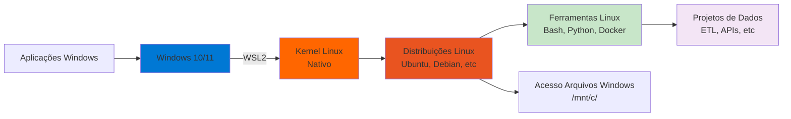

# Linux e WSL para Engenharia de Dados

## 📋 Sobre

Este módulo ensina como configurar e usar o **Windows Subsystem for Linux (WSL)** para criar um ambiente de desenvolvimento Linux dentro do Windows. O WSL é essencial para engenheiros de dados que trabalham no Windows, pois permite executar ferramentas e comandos Linux nativamente, sem necessidade de máquinas virtuais ou dual boot.

**Objetivo Educacional**: Dominar o WSL para criar um ambiente de desenvolvimento Linux profissional no Windows, essencial para trabalhar com ferramentas modernas de engenharia de dados.

## 🎯 Objetivos de Aprendizado

- **WSL**: Entender o que é e por que usar Windows Subsystem for Linux
- **Instalação**: Instalar e configurar WSL2 no Windows
- **Comandos Linux**: Dominar comandos essenciais do Linux/Bash
- **Ambiente de Desenvolvimento**: Configurar Python, Git, Docker e outras ferramentas no WSL
- **Integração Windows-Linux**: Trabalhar com arquivos e ferramentas entre os dois sistemas
- **Produtividade**: Aumentar eficiência no desenvolvimento de projetos de dados

## 📊 O que é WSL?



## 🛠️ Tecnologias e Ferramentas

- **WSL2**: Versão mais recente do Windows Subsystem for Linux
- **Ubuntu/Debian**: Distribuições Linux recomendadas
- **Bash**: Shell Linux padrão
- **Git**: Controle de versão (funciona melhor no Linux)
- **Python**: Linguagem de programação
- **Docker**: Containerização (integração nativa com WSL2)

## 📦 Pré-requisitos

- Windows 10 (versão 2004 ou superior) ou Windows 11
- Acesso de administrador
- Conexão com internet para download
- Conhecimento básico de terminal/comandos (opcional, será ensinado)

## 🚀 Como Usar Este Módulo

### Instalação do WSL

1. **Instalar WSL2 via PowerShell (como Administrador)**:
   ```powershell
   wsl --install
   ```
   
   Ou instalar uma distribuição específica:
   ```powershell
   wsl --install -d Ubuntu
   ```

2. **Reiniciar o computador** após a instalação

3. **Configurar usuário Linux** na primeira execução:
   - Criar nome de usuário
   - Definir senha

4. **Verificar instalação**:
   ```bash
   wsl --list --verbose
   ```

### Comandos Essenciais

#### Navegação
```bash
# Listar arquivos
ls
ls -la  # Lista detalhada

# Mudar diretório
cd /home/usuario
cd ..   # Voltar um nível

# Mostrar diretório atual
pwd

# Criar diretório
mkdir projeto-dados
```

#### Gerenciamento de Arquivos
```bash
# Copiar arquivo
cp arquivo.txt backup/

# Mover/Renomear
mv arquivo.txt novo_nome.txt

# Deletar arquivo
rm arquivo.txt
rm -r pasta/  # Deletar pasta recursivamente

# Ver conteúdo de arquivo
cat arquivo.txt
less arquivo.txt  # Visualizador paginado
```

#### Permissões
```bash
# Dar permissão de execução
chmod +x script.sh

# Mudar proprietário
chown usuario:grupo arquivo.txt
```

#### Gerenciamento de Pacotes (Ubuntu/Debian)
```bash
# Atualizar lista de pacotes
sudo apt update

# Instalar pacote
sudo apt install python3-pip

# Remover pacote
sudo apt remove nome-pacote
```

### Integração Windows-Linux

#### Acessar Arquivos do Windows
```bash
# Arquivos Windows ficam em /mnt/
cd /mnt/c/Users/seu_usuario/Documents
```

#### Acessar Arquivos do Linux no Windows
- Navegue para: `\\wsl$\Ubuntu\home\usuario\`
- Ou use: `\\wsl.localhost\Ubuntu\`

#### Executar Comandos Windows do Linux
```bash
# Executar comando Windows
cmd.exe /c "dir"
```

## 📚 Conteúdo Detalhado

### Por que WSL é Importante para Engenharia de Dados?

1. **Ferramentas Nativas**: Muitas ferramentas de dados funcionam melhor no Linux
   - Docker Desktop integra nativamente com WSL2
   - Git funciona mais rápido e confiável
   - Python e bibliotecas têm melhor suporte

2. **Ambiente de Produção**: Servidores de produção geralmente rodam Linux
   - Desenvolver no mesmo ambiente reduz bugs
   - Comandos e scripts são compatíveis

3. **Performance**: WSL2 usa um kernel Linux real
   - Muito mais rápido que máquinas virtuais
   - Acesso direto ao hardware

4. **Produtividade**: Melhor experiência de desenvolvimento
   - Terminal mais poderoso
   - Scripts Bash para automação
   - Ferramentas de linha de comando modernas

### Configuração de Ambiente de Desenvolvimento

#### Instalar Python e Gerenciadores
```bash
# Python (geralmente já vem instalado)
python3 --version

# pip
sudo apt install python3-pip

# Poetry (gerenciador de dependências)
curl -sSL https://install.python-poetry.org | python3 -
```

#### Instalar Git
```bash
sudo apt install git
git config --global user.name "Seu Nome"
git config --global user.email "seu@email.com"
```

#### Instalar Docker (via Docker Desktop)
- Docker Desktop detecta automaticamente o WSL2
- Não precisa instalar Docker dentro do WSL
- Containers rodam nativamente no WSL2

#### Configurar VS Code com WSL
1. Instalar extensão "Remote - WSL" no VS Code
2. Abrir terminal integrado: `Ctrl + Shift + '`
3. Abrir pasta do WSL: `code .` dentro do diretório Linux

## 🔗 Conexões com a Formação

- **Pré-requisitos**: 
  - Windows 10/11 instalado
  - Acesso de administrador
- **Próximos passos**: 
  - Módulo 01 (Git e GitHub) - Git funciona melhor no WSL
  - Módulo 02 (Deploy) - Docker integra perfeitamente com WSL2
  - Todos os projetos práticos podem ser executados no WSL

## 📖 Recursos Adicionais

- [Documentação Oficial do WSL](https://docs.microsoft.com/windows/wsl/)
- [Guia de Instalação WSL2](https://docs.microsoft.com/windows/wsl/install)
- [Comandos Linux Essenciais](https://www.guru99.com/linux-commands-cheat-sheet.html)
- [Bash Scripting Tutorial](https://www.gnu.org/software/bash/manual/)
- [WSL Tips and Tricks](https://docs.microsoft.com/windows/wsl/tips)

## ⚠️ Troubleshooting Comum

### WSL não inicia
```powershell
# Verificar status
wsl --status

# Reiniciar WSL
wsl --shutdown
wsl
```

### Problemas de performance
- Certifique-se de estar usando WSL2 (não WSL1)
- Verifique se arquivos do projeto estão no sistema de arquivos Linux (não em `/mnt/c/`)

### Permissões negadas
```bash
# Verificar permissões
ls -la

# Corrigir permissões
chmod +x script.sh
```

## 👤 Autor

**Luciano Filho** - [lvgalvaofilho@gmail.com](mailto:lvgalvaofilho@gmail.com)

---

**Parte da Formação Profissional em Engenharia de Dados - [Jornada de Dados](https://suajornadadedados.com.br/)**

