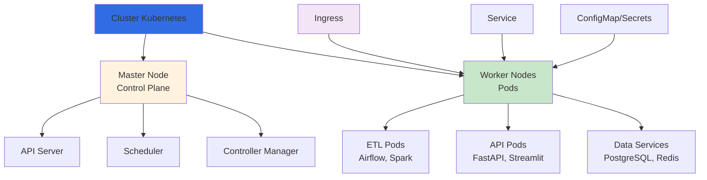

# DevOps e Kubernetes para Engenharia de Dados

## 📋 Sobre

Este módulo introduz **DevOps e Kubernetes** aplicados à engenharia de dados. Você aprenderá a orquestrar containers, gerenciar deployments de pipelines de dados e implementar práticas de DevOps em ambientes de produção.

**Objetivo Educacional**: Dominar Kubernetes e práticas DevOps para deploy, escalabilidade e manutenção de pipelines de dados em produção.

## 🎯 Objetivos de Aprendizado

- **Kubernetes**: Entender arquitetura e conceitos fundamentais do K8s
- **Orquestração de Containers**: Gerenciar aplicações de dados em clusters Kubernetes
- **Deploy de Pipelines**: Fazer deploy de ETLs, APIs e serviços de dados no K8s
- **Escalabilidade**: Escalar aplicações de dados horizontalmente
- **DevOps**: Implementar CI/CD para pipelines de dados
- **Monitoramento**: Observabilidade e logging em ambientes Kubernetes
- **Service Mesh**: Gerenciar comunicação entre microserviços de dados

## 📊 Arquitetura Kubernetes



## 🛠️ Tecnologias e Ferramentas

- **Kubernetes (K8s)**: Plataforma de orquestração de containers
- **Docker**: Containerização de aplicações
- **Helm**: Gerenciador de pacotes para Kubernetes
- **Kubectl**: CLI para gerenciar clusters Kubernetes
- **Minikube/Kind**: Ferramentas para desenvolvimento local
- **CI/CD**: GitHub Actions, GitLab CI, Jenkins
- **Monitoring**: Prometheus, Grafana, Loki

## 📦 Pré-requisitos

- Conhecimento de Docker e containers
- Conhecimento básico de Linux e linha de comando
- Experiência com pipelines de dados (ETL, APIs)
- Conhecimento básico de YAML
- Ambiente de desenvolvimento configurado

## 🚀 Conceitos Fundamentais

### O que é Kubernetes?

**Kubernetes (K8s)** é uma plataforma open-source para orquestração de containers que automatiza:
- Deploy de aplicações
- Escalabilidade
- Gerenciamento de recursos
- Auto-recuperação (self-healing)
- Balanceamento de carga

### Por que Kubernetes para Engenharia de Dados?

1. **Escalabilidade**: Escalar pipelines de dados conforme demanda
2. **Alta Disponibilidade**: Garantir que pipelines críticos estejam sempre rodando
3. **Recursos**: Gerenciar CPU e memória eficientemente
4. **Multi-cloud**: Portabilidade entre diferentes provedores cloud
5. **Orquestração**: Gerenciar múltiplos serviços de dados coordenadamente

### Componentes Principais

#### Pods
Menor unidade deployável no Kubernetes. Um Pod pode conter um ou mais containers.

```yaml
apiVersion: v1
kind: Pod
metadata:
  name: etl-pipeline
spec:
  containers:
  - name: etl
    image: my-etl:latest
```

#### Deployments
Gerenciam criação e atualização de Pods. Garantem que um número específico de Pods esteja rodando.

```yaml
apiVersion: apps/v1
kind: Deployment
metadata:
  name: airflow-deployment
spec:
  replicas: 3
  selector:
    matchLabels:
      app: airflow
  template:
    metadata:
      labels:
        app: airflow
    spec:
      containers:
      - name: airflow
        image: apache/airflow:latest
```

#### Services
Expõem aplicações dentro do cluster ou externamente. Permitem comunicação estável entre Pods.

```yaml
apiVersion: v1
kind: Service
metadata:
  name: airflow-service
spec:
  selector:
    app: airflow
  ports:
  - port: 8080
    targetPort: 8080
  type: LoadBalancer
```

#### ConfigMaps e Secrets
Gerenciam configurações e dados sensíveis separadamente do código.

```yaml
apiVersion: v1
kind: ConfigMap
metadata:
  name: etl-config
data:
  database_url: "postgresql://db:5432/mydb"
  batch_size: "10000"
```

## 📚 Casos de Uso em Engenharia de Dados

### 1. Deploy de Pipelines ETL
- Airflow no Kubernetes
- Spark Jobs escaláveis
- Processamento batch e streaming

### 2. APIs de Dados
- FastAPI com auto-scaling
- Streamlit dashboards
- Serviços REST para dados

### 3. Data Services
- PostgreSQL com alta disponibilidade
- Redis para cache
- Kafka para streaming

### 4. Observabilidade
- Logging centralizado
- Métricas de performance
- Alertas e monitoramento

## 🔗 Conexões com a Formação

- **Pré-requisitos**: 
  - Módulo 02 (Deploy com Docker) - Entender containers
  - Módulo 11 (Terraform) - Infraestrutura como código
  - Projetos de pipelines e APIs
- **Próximos passos**: 
  - Deploy de pipelines em produção
  - Arquiteturas de dados escaláveis
  - DevOps completo para dados

## 📖 Recursos Adicionais

- [Documentação Oficial do Kubernetes](https://kubernetes.io/docs/)
- [Kubernetes para Iniciantes](https://kubernetes.io/docs/tutorials/kubernetes-basics/)
- [Kubectl Cheat Sheet](https://kubernetes.io/docs/reference/kubectl/cheatsheet/)
- [Helm Documentation](https://helm.sh/docs/)
- [Kubernetes para Engenharia de Dados](https://kubernetes.io/blog/)

## 🎓 Próximos Passos

Este módulo será expandido com:
- Exemplos práticos de deploy de pipelines
- Configuração de clusters Kubernetes
- CI/CD para pipelines de dados
- Monitoramento e observabilidade
- Service mesh para microserviços de dados

## 👤 Autor

**Luciano Filho** - [lvgalvaofilho@gmail.com](mailto:lvgalvaofilho@gmail.com)

---

**Parte da Formação Profissional em Engenharia de Dados e Inteligência Artificial - [Jornada de Dados](https://suajornadadedados.com.br/)**

